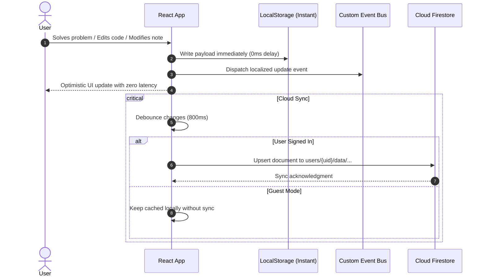

# ⚡ Heuristiq — Comprehensive DSA Prep & Engineering Workspace

<div align="center">


**An all-in-one, offline-first engineering workstation for Data Structures & Algorithms, interview prep, algorithm visualization, and competitive programming.**

[Features](#-key-features) • [Architecture](#-system-architecture) • [Tech Stack](#-tech-stack--tooling) • [Future Roadmap](#-future-roadmap--engineering-initiatives) • [Setup](#-getting-started) • [Security](#-security--storage-model)

</div>

---

## 📖 Overview

**Heuristiq** is a modern, high-performance web platform built to replace fragmented DSA study workflows. Instead of juggling separate browser tabs for problem sheets, code editors, whiteboards, notes, contest trackers, and analytics, Heuristiq brings everything together into a cohesive, keyboard-first, distraction-free environment.

Built with an **offline-first caching architecture**, user progress, notes, code drafts, and canvas diagrams are persisted locally in `localStorage` first and asynchronously synchronized with Google Cloud Firestore upon authentication.

---

## 🛠️ Tech Stack & Tooling

### Core Technologies

| Category | Technology | Description |
| :--- | :--- | :--- |
| **Frontend Framework** | **React 19** | Concurrent rendering, hooks-based modular architecture |
| **Build Tool** | **Vite 7** | Lightning-fast HMR and optimized Rollup code-splitting |
| **Styling & Theme** | **Tailwind CSS 4** | Glassmorphism, tailored HSL color tokens, dark/light aesthetics |
| **Code Editor** | **Monaco Editor** | The VS Code editor engine running directly in the browser |
| **Remote Compiler** | **Wandbox Sandbox API** | Zero-auth remote sandboxed code execution for C++, Java, Python, JS, C |
| **Canvas & Sketching** | **Excalidraw** | Embedded vector whiteboard with multi-scene autosaving |
| **Cloud & Database** | **Firebase Auth & Firestore** | Google OAuth, Email/Password auth, and real-time cloud document sync |
| **Icons & Typography** | **Lucide React & Akira** | Modern geometric iconography and custom display fonts |
| **Formula Rendering** | **KaTeX** | Ultra-fast LaTeX math rendering for algorithm complexity |

---

## 🏗️ System Architecture

Heuristiq follows a decoupled, client-centric architecture. The client handles state management, local indexing, and offline persistence, while Firebase provides secure document storage and authentication.


### Data Flow & Offline-First Synchronization



---

## 🖥️ Interactive Product Tour & Feature Walkthrough

### 1. 🎯 DSA Problem Sheets & Canonical Identity System (CID)
Heuristiq bundles the most respected interview preparation sheets into a single, unified interface:
* **10 Curated Sheet Collections:** Striver A2Z DSA Sheet (455+ questions), Blind 75, NeetCode 150, CodeStoryWithMIK, Top Interview 150, CSES Problem Set, CP-31 (800–1600 rated), and SQL 50.
* **Canonical Deduplication (CID Engine):** Automatically links identical problems across different sheets. If you solve *"Two Sum"* in Blind 75, it is automatically marked as solved in Striver A2Z and NeetCode 150.
* **Smart Filter Matrix:** Filter problems instantly by status (*Unsolved, Solved, Revision Starred*), topic categories (Arrays, DP, Graphs, Trees), and difficulty levels (*Easy, Medium, Hard*).
* **Direct Lecture Embeds:** Click on any problem to watch curated YouTube editorial walkthroughs directly in an embedded video modal without leaving your workspace.

### 2. 🏢 Company-Targeted Question Vault (50+ Companies)
Prepare specifically for your dream company with real interview frequency datasets:
* **50+ Tech Giants:** Curated question registries for **Google, Amazon, Meta, Microsoft, Apple, Uber, Netflix, Bloomberg, Oracle, Salesforce, Walmart Labs, Cisco, and 40+ more**.
* **Interview Frequency Scoring:** Identify top recurring questions based on real-world interview trends.
* **Integrated In-App Solver:** Launch any company question into the Monaco Editor with a single click.

### 3. ⚡ In-App Monaco Code Playground & Multi-Language Runner
Never break your flow switching to external IDEs:
* **Integrated VS Code Monaco Editor:** Full syntax highlighting, auto-completion, bracket matching, and indentation for **C++, Java, Python, JavaScript, and C**.
* **Zero-Auth Remote Sandbox (Wandbox API):** Run your algorithms in a secure sandbox with custom `stdin` input and real-time `stdout`/`stderr` output with execution timings.
* **Per-Question Draft Autosave:** Every draft you write is automatically saved to local storage and Firestore, so your solution is right there when you return.

### 4. 🔍 Interactive Algorithm Visualizer
Build deep spatial intuition for how complex algorithms operate under the hood:
* **Sorting Algorithms:** Step-by-step animations for Bubble Sort, Selection Sort, Insertion Sort, Merge Sort, and Quick Sort.
* **Search Algorithms:** Linear Search and Binary Search visual comparisons.
* **Graph & Grid Pathfinding:** Live 2D grid pathfinding simulations powered by Breadth-First Search (BFS) and Depth-First Search (DFS) with custom obstacles.
* **Player Controls:** Play, pause, step forward/backward, and adjust simulation speeds dynamically.

### 5. 🎨 Dual-Mode Excalidraw Vector Whiteboard
Sketch architectures, trace recursion trees, and diagram pointer layouts:
* **Dedicated Whiteboard Tab:** Full-screen vector sketching canvas with multi-board tab support and autosave.
* **Floating Quick-Draw Canvas:** Hit the floating whiteboard button from **any screen** (even while solving a question or looking at a chart) to bring up an overlay sketchpad without losing your current context.

### 6. 🏆 Contest Calendar & Live Contest Alert Banner
Never miss a rating round again:
* **Multi-Platform Contest Tracker:** Aggregates live and upcoming contests across **Codeforces, LeetCode, CodeChef, and AtCoder**.
* **Global Countdown Banner:** A persistent, non-intrusive alert banner highlights active or imminent contests with live countdowns and one-click registration links.

### 7. 📝 Central Notes Workspace & Study Journal
Keep all your DSA wisdom, interview takeaways, and algorithmic templates in one place:
* **Taggable & Searchable:** Create rich markdown notes organized with colored tags (e.g., `#patterns`, `#dp`, `#interview-prep`).
* **Question-Linked Notes:** Attach personalized notes directly to any problem sheet question; review them directly from the problem table or within the notes hub.

### 8. 👤 Developer Profile & Platform Handle Integration
* **Coding Platform Hub:** Link and display your **LeetCode, Codeforces, and CodeChef** profiles.
* **LeetCode Solve Synchronizer:** Automatically fetches recent accepted submissions using the public LeetCode GraphQL API and synchronizes your progress across your sheets.

### 9. ☁️ Seamless Dual-Sync Architecture (Offline-First)
* **Guest Mode:** Start practicing immediately without signing up. All data is saved instantly to browser `localStorage`.
* **Authenticated Cloud Sync:** Sign in seamlessly with **Google OAuth** or Email/Password via Firebase. Your local data is debounced and synchronized to Cloud Firestore so you can switch devices effortlessly.

### 10. 💬 Integrated User Feedback & Suggestion System
* **In-App Feedback Pipeline:** Dedicated feedback channel allowing developers and recruiters to submit feature suggestions, report edge-case bugs, or request new problem sheets.
* **Zero-Setup Email Delivery:** Powered by EmailJS directly from the client without requiring a backend mail server.
* **Validation & Toast Alerts:** Includes client-side file size and attachment validation with interactive toast notifications.

### 11. ⌨️ Global Command Palette (`Ctrl + K` / `Cmd + K`)
* Press `Ctrl + K` anywhere in the app to open the spotlight command palette.
* Fuzzy search through over 1,000+ problems, company questions, and learning roadmaps at lightning speed.

---

## 🚀 Future Roadmap & Engineering Initiatives

Heuristiq is evolving into a full-scale collaborative developer ecosystem. The following high-impact features are slated for upcoming releases:

### 🎮 1. Real-Time Multiplayer Collaborative IDE
> **A simplified Google Docs + VS Code multiplayer platform where multiple engineers can edit, discuss, and execute code simultaneously.**

* **Collaborative Coding Rooms:** Instantly spin up a private room with shareable invite codes and cryptographic room tokens.
* **Simultaneous Multi-User File Editing:** Multiple users editing the exact same file in real-time with zero lag.
* **Live Presence & Cursors:** Color-coded cursor positions, text selections, and user tags for every active participant.
* **In-Room Chat & Audio:** Low-latency chat and voice channels embedded directly inside the coding session.
* **Simultaneous Code Execution:** Shared stdout/stderr console allowing any participant to run the code and review test results together.
* **Granular Room Permissions:** Host, Editor, and Spectator roles to prevent unauthorized tampering during interview or pairing sessions.
* **Version History & Session Recording:** Time-travel debugging with full session recording and playback to review how a solution evolved step-by-step.
* **The Engineering Challenge (The "Hard Part"):**
  * Implementing **WebSockets** coupled with **Conflict-free Replicated Data Types (CRDTs / Yjs)** or **Operational Transformation (OT)** algorithms.
  * Handling network jitter, causal consistency, split-brain reconnections, and race conditions so concurrent edits from users with high-latency connections never overwrite or clobber each other.

---

### 🧠 2. Context-Aware AI Question Assistant
* **Socratic Hint Engine:** Step-by-step hints and algorithmic guidance tailored to the user's specific progress without spoiling the entire solution.
* **Draft Code Diagnostician:** Analyzes user code in the Monaco Editor to spot subtle off-by-one errors, infinite loops, and unhandled edge cases.
* **Complexity Auditor:** Explains time and space complexity with Big-O breakdown based on the user's written implementation.

---

### 📚 3. RAG Pipeline for Lecture Summaries & Study Material
* **Retrieval-Augmented Generation (RAG):** Integration with YouTube video playlists (Striver, Love Babbar, CodeStoryWithMIK).
* **Vector Semantic Search:** Video transcripts and study guides chunked and vectorized (ChromaDB / Pinecone embeddings).
* **Instant Concept Extraction:** Query any video or study doc to get concise TL;DR summaries, key pseudocode, and timestamp deep-links directly to the explanation.

---

### ⚔️ 4. Competitive Programming Arena & 1v1 Code Battles
* **Live Head-to-Head Showdowns:** Real-time 1v1 matches where participants race to solve DSA problems within time constraints.
* **Elo-Based Matchmaking:** Dynamic leaderboard and skill ratings adjusting with wins and losses.
* **Automated Judge Pipeline:** Automated test case validation with memory and time limit enforcement.

---

### 👥 5. Developer Social Graph & Community Hub
* **Follow / Following System:** Follow peers, track their daily solve streaks, and view activity feeds.
* **Direct & Group Messaging:** Real-time chat for discussing problem strategies, interview experiences, and company hiring trends.
* **Solution Sharing & Peer Code Reviews:** Publish documented solutions for community feedback, upvotes, and alternative approaches.

---

### 🏛️ 6. Core Computer Science, MCQs & System Design
* **Core CS Foundations:** Dedicated revision sheets and notes for **Operating Systems (OS), Database Management Systems (DBMS), Computer Networks (CN), and Object-Oriented Programming (OOPS)**.
* **Timed MCQ Bank:** Quiz engine with explanations covering standard placement and GATE-level CS concepts.
* **System Design Interactive Primer:** High-Level Design (HLD) and Low-Level Design (LLD) architectural templates, visual blueprints, and case studies (Rate Limiter, URL Shortener, Chat System, Video Streaming).

---

### 🔬 7. Next-Gen Algorithm Visualizations
* **Dynamic Programming Matrix Visualizer:** Visual 2D table fill-ups showcasing memoization and tabulation state transitions.
* **Tree & Graph Topologies:** Interactive node manipulation for Red-Black Trees, AVL rotations, Tries, Segment Trees, and Dijkstra's / Floyd-Warshall algorithms.

---

## 💻 Getting Started

### Prerequisites
* **Node.js**: v18.0.0 or higher
* **npm**: v9.0.0 or higher

### Local Development

1. **Clone the repository:**
   ```bash
   git clone https://github.com/adit-syntax/heuristiq.git
   cd heuristiq
   ```

2. **Navigate to the frontend workspace & install dependencies:**
   ```bash
   cd frontend
   npm install
   ```

3. **Start the local development server:**
   ```bash
   npm run dev
   ```
   Open `http://localhost:5173/` in your browser.

4. **Run production build:**
   ```bash
   npm run build
   ```

5. **Run live checks & unit tests:**
   ```bash
   npm run check
   ```

---

## 🔒 Security & Storage Model

| Data Domain | Guest Mode | Authenticated User |
| :--- | :--- | :--- |
| **Progress & Solves** | `localStorage` (`heuristiq_solved`) | Synced to `users/{uid}/data/progress` |
| **User Notes** | `localStorage` (`heuristiq_notes`) | Synced to `users/{uid}/data/notes` |
| **Code Drafts** | `localStorage` (`heuristiq_code`) | Synced to `users/{uid}/data/code` |
| **Whiteboard Canvases** | `localStorage` (`heuristiq_boards`) | Synced to `users/{uid}/data/boards` |

### Cloud Security Rules
Firestore rules enforce that every document in `users/{userId}/data/{docId}` can only be read or written by the authenticated user whose `request.auth.uid == userId`. Guest mode operates completely locally without exposing data over the wire.

To deploy Firestore rules:
```bash
npm install -g firebase-tools
firebase login
firebase deploy --only firestore:rules
```

---

## 👤 Author & Contributor

**Aditya Singh**
* GitHub: [@adit-syntax](https://github.com/adit-syntax)
* Email: [aditsyntax@gmail.com](mailto:aditsyntax@gmail.com)

---

## 📄 License

This project is licensed under the [MIT License](LICENSE) — feel free to use, modify, and build upon this project.
